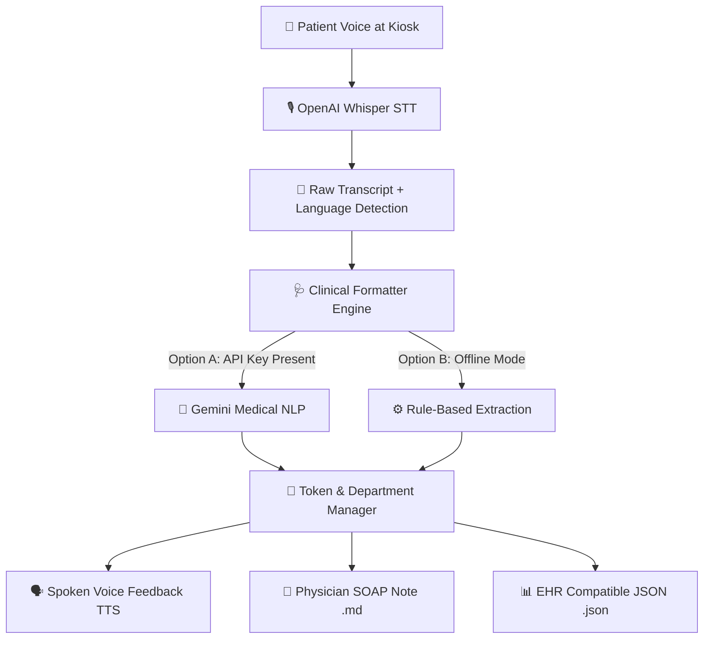

# 🏥 Interactive Patient Kiosk Voice-to-Text Clinical Pipeline (SIH 2026)

An open-source, AI-powered Voice-to-Text interactive kiosk system that converts patient speech recorded at hospital/clinic kiosks into **Physician-Ready SOAP Notes** while providing **Spoken Voice Feedback (TTS)**, **Appointment Token Generation**, **Department Routing**, and **Estimated Wait Times**.

Powered by **OpenAI Whisper** (Speech-to-Text), **Clinical Structuring Engine**, and **Text-to-Speech (TTS)**.

---

## 🚀 Key Features

1. **Interactive Spoken Voice Kiosk (TTS)**: Greets the patient out loud and speaks their status, appointment token, triage level, assigned department room, and instructions after speech analysis.
2. **Appointment Token & Department Routing**: Automatically issues sequential appointment tokens (e.g. `TK-101`) and routes patients to the correct department (`General Medicine`, `Neurology OPD`, `Emergency Care Unit`, etc.) with estimated wait times.
3. **Multilingual Speech-to-Text**: Uses OpenAI Whisper to transcribe audio with automatic language detection (English, Hindi, Tamil, Telugu, Kannada, Bengali, Marathi, etc.).
4. **Physician-Ready SOAP Notes**: Transforms raw patient transcriptions into structured clinical sections (Chief Complaint, HPI, Reported Symptoms, Medications, Triage Urgency).
5. **Dual Structuring Engine**:
   - **AI Structuring**: Uses Gemini API for medical NLP entity extraction when `GEMINI_API_KEY` is provided.
   - **Offline Rule-based Fallback**: Works completely offline out-of-the-box without requiring API keys.
6. **Dual Output Formats**: Generates both human-readable Markdown reports (`.md`) and machine-readable EHR JSON files (`.json`).

---

## 📐 Architecture Diagram



---

## 📁 Repository Structure

```
SIH_2026/
├── interactive_kiosk.py     # Main interactive kiosk launcher with voice TTS feedback & token pass
├── record_and_transcribe.py  # Continuous voice recorder & CLI pipeline (--voice supported)
├── kiosk_manager.py         # Appointment token generator, triage level, and department routing
├── tts_engine.py            # Text-to-Speech (TTS) voice synthesis engine
├── clinical_formatter.py    # SOAP note formatter engine (AI + Rule-based fallback)
├── transcribe.py            # Audio file processor CLI
├── create_sample_audio.py   # Utility script to generate test audio WAV files
├── requirements.txt         # Project Python dependencies
└── outputs/                 # Output folder for generated Markdown and JSON notes
```

---

## 🛠️ Quick Start Guide

### 1. Setup Virtual Environment & Dependencies

```powershell
# Create virtual environment
python -m venv .venv

# Activate virtual environment (Windows PowerShell)
.venv\Scripts\Activate.ps1

# Install dependencies
pip install -r requirements.txt
```

---

## 🧪 Usage Examples

### Option 1: Interactive Voice Kiosk (Recommended for Patients)

Runs the fully interactive patient kiosk. It speaks to the patient, records their voice, analyzes symptoms, generates an **Appointment Token Pass**, and speaks their status and room assignment out loud!

```powershell
.venv\Scripts\python interactive_kiosk.py
```

Or run via the batch shortcut:
```cmd
run_mic.bat
```

- **Step 1**: Kiosk speaks: *"Welcome to the Patient Kiosk. Press ENTER when ready..."*
- **Step 2**: Speak symptoms freely.
- **Step 3**: Kiosk analyzes audio, prints the appointment token card, and speaks out your token number, room assignment, wait time, and next steps!

---

### Option 2: Record Live Voice with Voice Feedback

```powershell
.venv\Scripts\python record_and_transcribe.py --voice
```

*To specify a specific microphone device ID (e.g. mic #1):*
```powershell
.venv\Scripts\python record_and_transcribe.py --device 1 --voice
```

---

### Option 3: Process an Existing Audio File

To process an existing audio file (`.wav`, `.mp3`, `.m4a`, etc.):

```powershell
.venv\Scripts\python transcribe.py --audio sample_patient_voice.wav
```

---

## 📄 Sample Output (Token Pass & Physician Summary)

### Terminal Screen & Spoken Feedback:

```
============================================================
🏥  PATIENT KIOSK - APPOINTMENT TOKEN PASS
============================================================
  🎫 TOKEN NUMBER:      [TK-101]
  🚨 TRIAGE PRIORITY:   ROUTINE
  🏢 DEPARTMENT:        Neurology OPD
  🚪 ASSIGNED ROOM:     Room 204
  ⏱️ ESTIMATED WAIT:    10 to 15 mins
============================================================
```

**🗣️ Spoken Voice Message to Patient:**
> *"Thank you. Your symptoms have been analyzed. Your appointment token number is TK-101. Your priority status is Routine. Please proceed to Neurology OPD, Room 204. Your estimated wait time is 10 to 15 minutes. Your summary is sent to the physician."*

---

## 🔑 Optional: Enable AI Extraction with Gemini

Set your Gemini API key in your terminal session to enable LLM-based medical entity extraction:

**Windows PowerShell:**
```powershell
$env:GEMINI_API_KEY="YOUR_GEMINI_API_KEY"
```

---

## 🏆 Hackathon Details
- **Project**: Interactive Patient Kiosk Voice-to-Text & Token System
- **Target Event**: SIH 2026 (Smart India Hackathon)
- **License**: MIT
