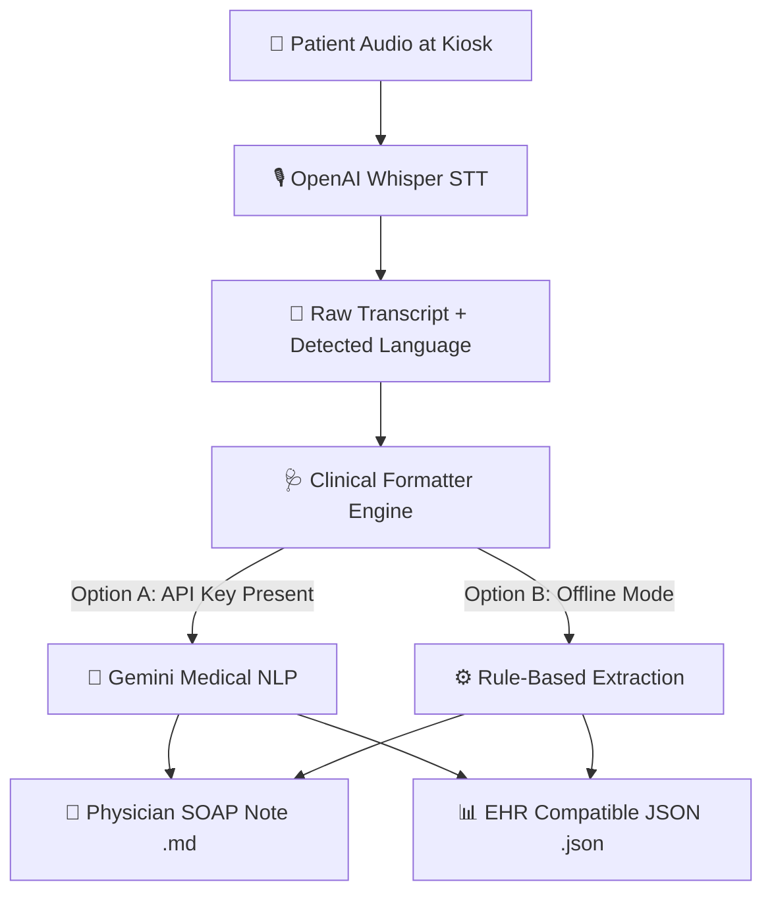

# 🏥 Patient Kiosk Voice-to-Text Clinical Pipeline (SIH 2026)

An open-source, AI-powered Voice-to-Text pipeline that converts patient speech recorded at hospital/clinic kiosks into **Physician-Ready SOAP Notes**.

Powered by **OpenAI Whisper** (Speech-to-Text) and a **Clinical Structuring Engine**.

---

## 🚀 Key Features

1. **Multilingual Speech-to-Text**: Uses OpenAI Whisper to transcribe audio files (`.wav`, `.mp3`, `.m4a`, `.flac`) with automatic language detection (English, Hindi, Tamil, Telugu, Kannada, Bengali, Marathi, etc.).
2. **Physician-Ready Format (SOAP Notes)**: Transforms raw, informal patient transcriptions into structured clinical sections:
   - **Chief Complaint (CC)**
   - **History of Present Illness (HPI)**
   - **Reported Symptoms**
   - **Medications & Treatments**
   - **Triage Urgency Priority Level** (`Routine`, `High`, `Emergency`)
3. **Dual Structuring Engine**:
   - **AI Structuring**: Uses Gemini API for medical NLP entity extraction when `GEMINI_API_KEY` is provided.
   - **Offline Rule-based Fallback**: Works completely offline out-of-the-box without requiring API keys or internet connection.
4. **Dual Output Formats**: Generates both human-readable Markdown reports (`.md`) and machine-readable EHR JSON files (`.json`).

---

## 📐 Architecture Diagram



---

## 📁 Repository Structure

```
SIH_2026/
├── transcribe.py            # Main CLI script to transcribe and convert audio
├── clinical_formatter.py    # SOAP note formatter engine (AI + Rule-based fallback)
├── create_sample_audio.py   # Utility script to generate sample test WAV files
├── requirements.txt         # Project Python dependencies
└── outputs/                 # Output folder for generated Markdown and JSON notes
```

---

## 🛠️ Quick Start Guide

### 1. Prerequisites
Ensure Python 3.10+ is installed on your system.

### 2. Setup Virtual Environment & Dependencies

```bash
# Create virtual environment
python -m venv .venv

# Activate virtual environment (Windows PowerShell)
.venv\Scripts\Activate.ps1

# Install dependencies
pip install -r requirements.txt
```

---

## 🧪 Usage Examples

### Option 1: Record Your Live Voice (Unlimited Recording)

Record your voice continuously without any fixed time limit! You can speak for as long as you need, then press **ENTER** when finished:

```powershell
.venv\Scripts\python record_and_transcribe.py
```

- **Step 1**: Press **ENTER** to start recording.
- **Step 2**: Speak all your symptoms freely (no time limit).
- **Step 3**: Press **ENTER** again when finished speaking. It will immediately transcribe and generate the physician report!

*To specify a specific microphone device ID (e.g. mic #1):*
```powershell
.venv\Scripts\python record_and_transcribe.py --device 1
```

---

### Option 2: Process an Existing Audio File

To process an existing patient audio file (`.wav`, `.mp3`, `.m4a`, etc.):

```powershell
.venv\Scripts\python transcribe.py --audio path/to/patient_voice.wav
```

### Advanced CLI Options

| Argument | Short | Default | Description |
| :--- | :--- | :--- | :--- |
| `--audio` | `-a` | *Required* | Path to the patient audio file (`.wav`, `.mp3`, `.m4a`, etc.) |
| `--model` | `-m` | `base` | Whisper model size (`tiny`, `base`, `small`, `medium`, `large`) |
| `--language`| `-l` | `auto` | Language code (e.g. `en`, `hi`, `ta`) or `auto` for auto-detect |
| `--output-dir`| `-o`| `outputs` | Folder to save output `.md` and `.json` files |

Example specifying model size and language:
```bash
python transcribe.py --audio patient_hindi.wav --model small --language hi
```

---

## 📄 Sample Output (Physician-Ready Format)

### Markdown Report (`outputs/sample_clinical_summary.md`):

```markdown
# 🏥 Patient Clinical Summary (Physician Ready)
**Triage Urgency Level**: `High`

## 📌 Chief Complaint (CC)
- Severe right-sided headache, nausea

## 📜 History of Present Illness (HPI)
Patient reports severe throbbing headache on the right side starting yesterday morning, accompanied by mild nausea. Self-administered paracetamol with minimal relief.

## 🩺 Reported Symptoms
- Right-sided throbbing headache
- Nausea

## 💊 Current Medications & Interventions
- Paracetamol (self-administered)

## 👨‍⚕️ Executive Summary for Physician
Patient presenting with acute onset right-sided throbbing headache and nausea for >24 hours. Minimal relief with OTC paracetamol. Needs physical examination and neurological check.

---
### 🎙️ Raw Patient Audio Transcript
> "I have had a severe headache since yesterday morning. It's on the right side of my head and throbbing. I feel a bit nauseous too. I took paracetamol but it didn't help much."
```

---

## 🔑 Optional: Enable AI Extraction with Gemini

To enable advanced generative AI clinical note generation, set your API key in your terminal:

**Windows PowerShell:**
```powershell
$env:GEMINI_API_KEY="YOUR_GEMINI_API_KEY"
```

**Linux/macOS:**
```bash
export GEMINI_API_KEY="YOUR_GEMINI_API_KEY"
```

---

## 🏆 Hackathon Details
- **Project**: Patient Kiosk Voice-to-Text & Physician Formatter
- **Target Event**: SIH 2026 (Smart India Hackathon)
- **License**: MIT
